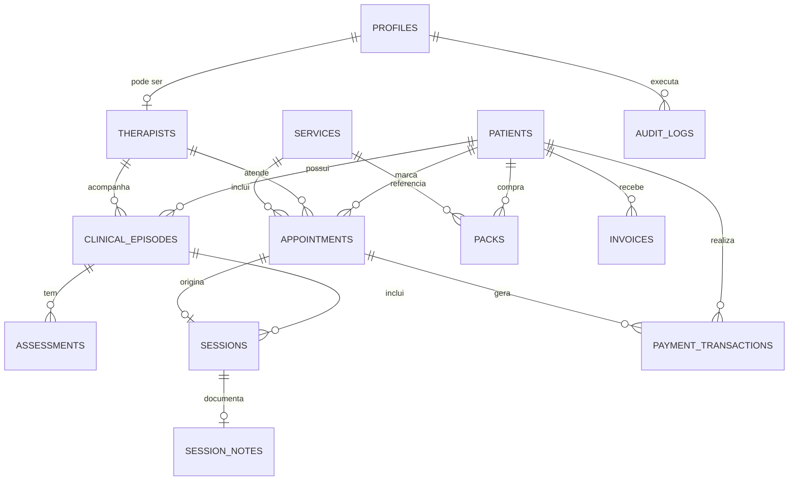

# ERD inicial

A migração correspondente está em `supabase/migrations/202609220001_initial_schema.sql`.

## Decisões iniciais

- A autenticação fica no `auth.users` do Supabase; `profiles` guarda o papel operacional.
- Dados clínicos têm tabelas próprias e políticas RLS restritas a administradores e fisioterapeutas.
- Pacientes usam `deleted_at` para permitir soft delete e preservar auditoria.
- Integrações externas usam `external_booking_id` e `reference` como identificadores idempotentes.
